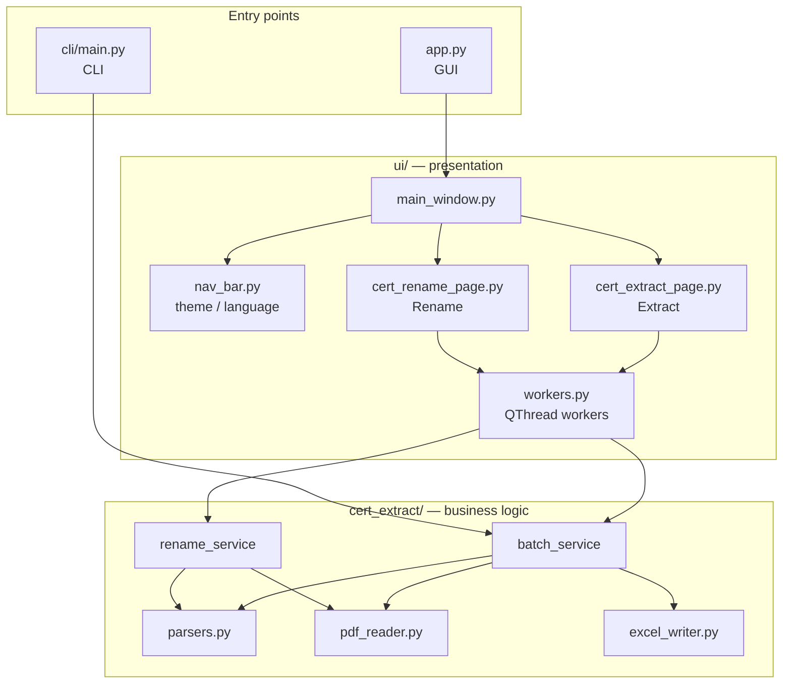
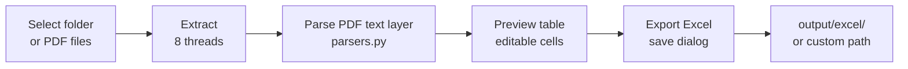
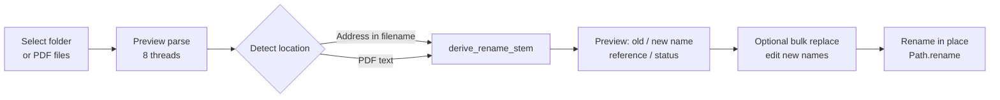
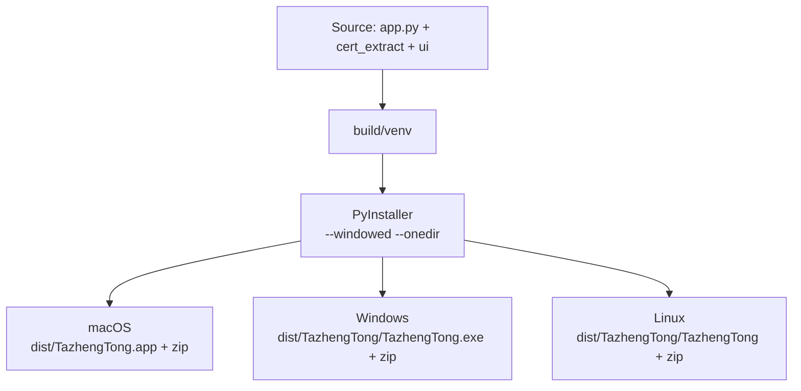

# TazhengTong Desktop

A PySide6 desktop toolkit for **Chinese real-estate registration certificate PDFs** (不动产登记证明). Batch-extract fields to Excel, rename PDFs by property location, switch between Chinese/English UI, and choose from 12 color themes with light/dark modes.

**Version:** first line of the root `version` file (e.g. `1.0.1`)  
**Distribution name:** `TazhengTong`

> **Note:** Only electronic PDFs with a **text layer** are supported. Scanned documents require OCR (planned).

---

## Features

| Feature | Description |
|---------|-------------|
| **Extract** | Pick a folder or multiple PDFs → 8-thread parsing → editable preview table → export to Excel |
| **Rename** | Pick a folder or multiple PDFs → detect location → preview new filenames (editable, bulk A→a replace) → rename in place |
| **CLI** | Headless batch extraction for scripts and CI |
| **Appearance** | 12 color palettes × light/dark; language toggle (中文 / EN) in the nav bar |

**Extracted fields:** filename, rights holder, property location, mortgage certificate no., original mortgage certificate no., property title certificate no.

---

## Architecture

### Application structure



### Extract workflow (GUI)



### Rename workflow (GUI)



New filenames use the full property location (e.g. `金东区…商11幢302商室.pdf`). Invalid filename characters are replaced automatically.

### Build pipeline



PyInstaller **does not cross-compile**. Build each platform on its native OS, or use GitHub Actions (see below).

---

## Project layout

```
cert-extract-desktop/
├── version                 # App version (single line)
├── app.py                  # GUI entry point
├── cli/main.py             # CLI entry point
├── cert_extract/
│   ├── core/               # Parsing, PDF I/O, Excel export
│   ├── services/           # Batch extract & rename orchestration
│   └── version.py
├── ui/
│   ├── main_window.py
│   ├── nav_bar.py          # Navigation, theme, language
│   ├── theme.py            # 12 themes (QSS)
│   ├── i18n.py             # zh / en strings
│   ├── workers.py          # ExtractThread, RenamePreviewThread
│   ├── pages/
│   └── dialogs/
├── build/
│   ├── build_mac.sh
│   ├── build_linux.sh
│   └── build_windows.bat
├── .github/workflows/build.yml
├── pdf/                    # Sample / input PDFs (optional)
└── output/
    ├── excel/              # Default CLI Excel output
    └── logs/               # Dev-mode logs
```

---

## Requirements

- Python **3.10+**
- Dependencies in `requirements.txt`: `PySide6`, `pypdf`, `pdfplumber`, `openpyxl`

---

## Development

### macOS / Linux

```bash
cd cert-extract-desktop
python3 -m venv .venv
source .venv/bin/activate
pip install -r requirements.txt

python app.py                              # GUI
python cli/main.py --dirs test --lang zh   # CLI
```

### Windows

```cmd
cd cert-extract-desktop
python -m venv .venv
.venv\Scripts\activate
pip install -r requirements.txt

python app.py
python cli\main.py --dirs test --lang zh
```

### UI / theme tweaks

| File | Purpose |
|------|---------|
| `ui/theme.py` | 12 full themes (background, panels, inputs) × light/dark |
| `ui/main_window.py` | Layout and widget `objectName` values (QSS selectors) |
| `ui/i18n.py` | Chinese and English copy |

The nav bar supports live switching: **color palette** (two rows × 6 colors) | **light/dark** | **中文/EN**.  
High-DPI / Retina rendering is enabled via `HighDpiScaleFactorRoundingPolicy` in `app.py`.

Dev logs are written to `output/logs/app.log` (UTF-8).

---

## CLI

```bash
# Batch by subfolders under pdf/ (default output: output/excel/)
python cli/main.py --dirs test --lang zh

# Explicit folders or PDF files
python cli/main.py --source pdf/test file1.pdf file2.pdf --output-dir output --lang en
```

| Flag | Description |
|------|-------------|
| `--pdf-dir` | PDF root directory (default: `pdf`) |
| `--dirs` | Subfolder names under `--pdf-dir` (multiple allowed) |
| `--source` | Folder or PDF paths (multiple allowed; overrides `--dirs`) |
| `--output-dir` | Output directory (default: `output`) |
| `--lang` | `zh` or `en` (Excel headers follow language) |

---

## Building & releases

Build scripts create `build/venv`, install PyInstaller and dependencies, package the app, and produce a zip.  
The version comes from the root **`version`** file (bundled via `--add-data`). Zip names follow `*_v{version}.zip`.

### GitHub Actions (all three platforms — free on public repos)

Push a `v*` tag or manually run **Actions → Build Release**:

| Artifact | Platform |
|----------|----------|
| `dist/TazhengTong_windows_v*.zip` | Windows |
| `dist/TazhengTong_mac_v*.zip` | macOS |
| `dist/TazhengTong_linux_v*.zip` | Linux |

Example:

```bash
git tag v1.0.1
git push origin v1.0.1
```

On tag push, all three jobs run in parallel and assets are attached to a GitHub Release.

### macOS (local)

```bash
chmod +x build/build_mac.sh
./build/build_mac.sh
```

| Output | Notes |
|--------|-------|
| `dist/TazhengTong.app` | Double-click to run |
| `dist/TazhengTong_mac_v*.zip` | Distribution archive |

The script applies an ad-hoc signature (`codesign -s -`). If Gatekeeper blocks the app: right-click → **Open**.

### Windows (local)

```cmd
build\build_windows.bat
```

| Output | Notes |
|--------|-------|
| `dist\TazhengTong\TazhengTong.exe` | Ship the whole folder, not just the `.exe` |
| `dist\TazhengTong_windows_v*.zip` | Distribution archive |

### Linux (local)

```bash
chmod +x build/build_linux.sh
./build/build_linux.sh
```

| Output | Notes |
|--------|-------|
| `dist/TazhengTong/TazhengTong` | Ship the whole folder |
| `dist/TazhengTong_linux_v*.zip` | Distribution archive |

Runtime libraries (Ubuntu/Debian example):

```bash
sudo apt-get install libgl1 libxkbcommon-x11-0 libxcb-cursor0 libfontconfig1
```

### Shared PyInstaller flags

- `--windowed` — no console window  
- `--onedir` — folder bundle (faster startup, easier debugging)  
- `--collect-all PySide6` / `shiboken6` — bundle Qt runtime  
- `--hidden-import` — `pypdf`, `openpyxl`

### Clean rebuild

```bash
rm -rf build/venv dist build/TazhengTong   # macOS / Linux
# Windows: rmdir /s /q build\venv dist
```

---

## Platform support

| Platform | Run from source | Local build |
|----------|-----------------|-------------|
| macOS | Yes | `build/build_mac.sh` |
| Windows | Yes | `build/build_windows.bat` |
| Linux | Yes | `build/build_linux.sh` |

Paths use `pathlib.Path`. Rename logic sanitizes Windows-invalid characters: `\ / : * ? " < > |`.
