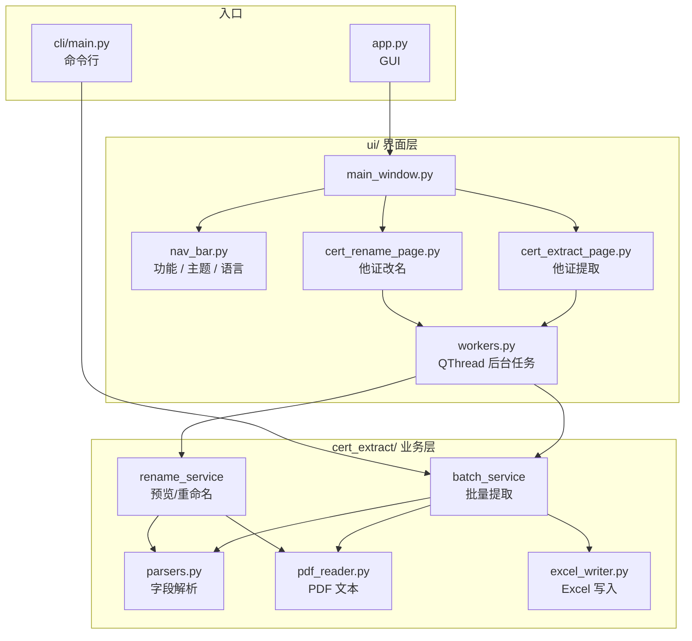
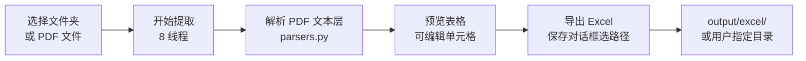
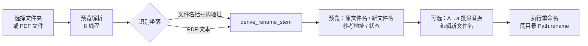
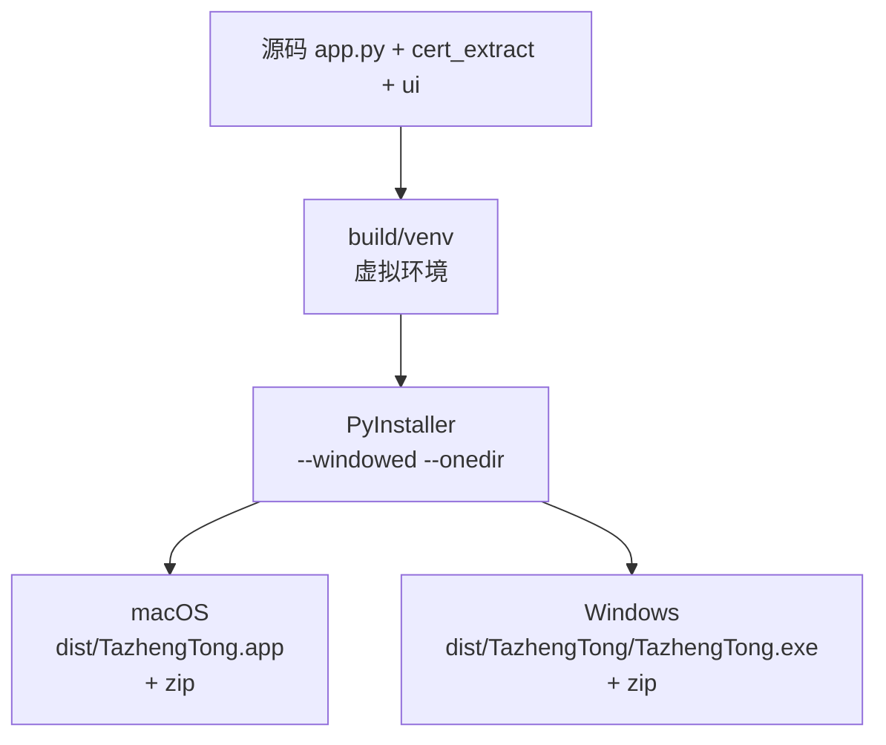

# 他证通 / TazhengTong Desktop

不动产登记证明 PDF 桌面工具集（PySide6）。支持批量提取字段到 Excel、按坐落批量重命名 PDF，界面中英切换、12 套主题 × 明暗模式。

**版本**：根目录 `version` 文件（首行，如 `1.0.0`）  
**打包名**：`TazhengTong`

---

## 功能概览

| 功能 | 说明 |
|------|------|
| **他证提取** | 选文件夹或多 PDF → 8 线程解析 → 预览表格（可编辑）→ 导出 Excel |
| **他证改名** | 选文件夹或多 PDF → 识别坐落 → 预览新文件名（可编辑、A→a 批量替换）→ 执行重命名 |
| **CLI** | 无 GUI 批量提取，适合脚本/CI |
| **外观** | 12 套配色 × 深色/浅色；导航栏切换语言（中/EN） |

> 仅支持带**文字层**的电子 PDF；扫描件需 OCR（后续可扩展）。

---

## 链路图

### 应用结构



### 他证提取（GUI）



**提取字段**：文件名、权利人、坐落、他项权证号、原抵押权证明号、不动产权证号。

### 他证改名（GUI）



**新文件名** = 完整坐落（如 `金东区…商11幢302商室.pdf`），非法字符自动替换。

### 打包链路



> PyInstaller **不支持交叉编译**：Mac 包只能在 Mac 上打，Windows 包只能在 Windows 上打（本机 / 虚拟机 / GitHub Actions 均可）。

---

## 项目结构

```
cert-extract-desktop/
├── version                       # 应用版本号（单行）
├── app.py                          # GUI 入口
├── cli/main.py                     # CLI 入口
├── cert_extract/
│   ├── core/                       # 解析、PDF 读取、Excel 写入
│   ├── services/
│   │   ├── batch_service.py        # 批量提取编排
│   │   └── rename_service.py       # 改名预览 / 执行
│   └── version.py
├── ui/
│   ├── main_window.py              # 主窗口、页面切换
│   ├── nav_bar.py                  # 导航、主题、语言
│   ├── theme.py                    # 12 套主题 QSS
│   ├── i18n.py                     # 中英文案
│   ├── workers.py                  # ExtractThread / RenamePreviewThread
│   ├── pages/
│   │   ├── cert_extract_page.py
│   │   └── cert_rename_page.py
│   └── dialogs/
│       └── bulk_replace_dialog.py
├── build/
│   ├── build_mac.sh                # macOS 打包
│   └── build_windows.bat           # Windows 打包
├── pdf/                            # 待处理 PDF（可按子目录分组）
└── output/
    ├── excel/                      # CLI 默认 Excel 输出
    └── logs/                       # 开发模式日志
```

---

## 环境要求

- Python **3.10+**
- 依赖见 `requirements.txt`：`PySide6`、`pypdf`、`pdfplumber`、`openpyxl`

---

## 开发运行

### macOS / Linux

```bash
cd cert-extract-desktop
python3 -m venv .venv
source .venv/bin/activate
pip install -r requirements.txt

python app.py          # GUI
python cli/main.py --dirs test --lang zh   # CLI
```

### Windows

```cmd
cd cert-extract-desktop
python -m venv .venv
.venv\Scripts\activate
pip install -r requirements.txt

python app.py
python cli\main.py --dirs test --lang zh
```

### 样式调试

| 文件 | 作用 |
|------|------|
| `ui/theme.py` | 12 套完整主题（背景/面板/输入框/日志区）× 明暗；改 `_THEMES` 与 `build_stylesheet()` |
| `ui/main_window.py` | 布局、控件 `objectName`（对应 QSS 选择器） |
| `ui/i18n.py` | 中英文案 |

导航栏可实时切换：**主题配色**（两行各 6 色）| **浅色/深色** | **中/EN**。  
`app.py` 已开启 `HighDpiScaleFactorRoundingPolicy`，高 DPI / Retina 屏显示更清晰。

---

## CLI 用法

```bash
# 按 pdf/ 下子目录批量提取（默认输出到 output/excel/）
python cli/main.py --dirs test --lang zh

# 指定文件夹或 PDF 列表
python cli/main.py --source pdf/test file1.pdf file2.pdf --output-dir output --lang en

# 参数说明
#   --pdf-dir      PDF 根目录（默认 pdf）
#   --dirs         根目录下子文件夹名（可多选）
#   --source       文件夹或 PDF 路径（可多选，优先于 --dirs）
#   --output-dir   输出目录（默认 output）
#   --lang         zh | en（Excel 表头随语言）
```

---

## 打包发布

脚本会自动：创建 `build/venv` → 安装 PyInstaller 与依赖 → 打包 → 生成 zip。  
版本号取自项目根目录 **`version` 文件**首行（打包时通过 `--add-data` 一并打入）。当前 zip 名为 `*_v1.0.0.zip`。

### macOS（必须在 Mac 上执行）

```bash
cd cert-extract-desktop
chmod +x build/build_mac.sh
./build/build_mac.sh
```

| 产物 | 说明 |
|------|------|
| `dist/TazhengTong.app` | 可直接双击运行 |
| `dist/TazhengTong_mac_v1.0.0.zip` | 分发用压缩包 |

脚本还会对 `.app` 做本地 ad-hoc 签名（`codesign -s -`）。  
若 Gatekeeper 拦截：右键 `.app` → **打开**。

### Windows（必须在 Windows 上执行）

PyInstaller 无法从 Mac/Linux 交叉编译出 `.exe`，需在 Windows 本机、虚拟机或 CI（如 GitHub Actions `windows-latest`）中执行：

```cmd
cd cert-extract-desktop
build\build_windows.bat
```

| 产物 | 说明 |
|------|------|
| `dist\TazhengTong\TazhengTong.exe` | 主程序（同目录含依赖 DLL，须整文件夹分发） |
| `dist\TazhengTong_windows_v1.0.0.zip` | 分发用压缩包（含整个 `TazhengTong` 目录） |

> 不要只拷贝单个 `.exe`；请分发 zip 或整个 `dist\TazhengTong\` 文件夹。

### 打包参数（两平台一致）

- `--windowed`：无控制台窗口  
- `--onedir`：目录式分发（启动快、便于排查）  
- `--collect-all PySide6` / `shiboken6`：打包 Qt 运行时  
- `--hidden-import`：`pypdf`、`openpyxl`

### 清理后重打

```bash
rm -rf build/venv dist build/TazhengTong   # macOS / Linux
# 或 Windows: rmdir /s /q build\venv dist
```

---

## 平台说明

| 平台 | 开发运行 | 打包 |
|------|----------|------|
| macOS | ✅ | ✅ `build_mac.sh` |
| Windows | ✅ | ✅ `build_windows.bat`（仅 Windows 环境） |
| Linux | ✅ 源码运行 | ⚠️ 无专用脚本，可参考 mac 脚本改 PyInstaller 命令 |

路径均使用 `pathlib.Path`，文件名重命名已过滤 Windows 非法字符 `\ / : * ? " < > |`。

---

## 注意事项

- Excel 表头随界面/CLI 语言切换（中/英）。
- 重命名时若 PDF 被其他程序占用，Windows 上可能失败（需关闭占用进程后重试）。
- 开发模式日志：`output/logs/app.log`（UTF-8）。
